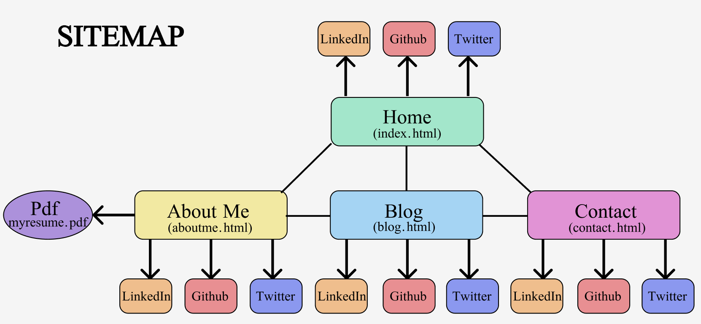
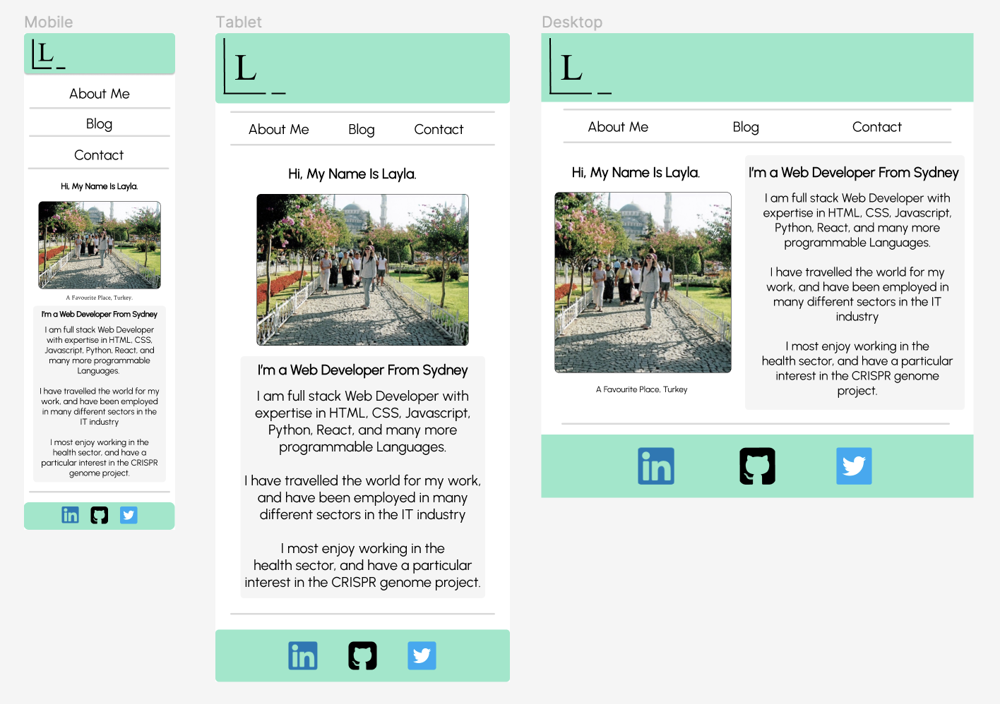
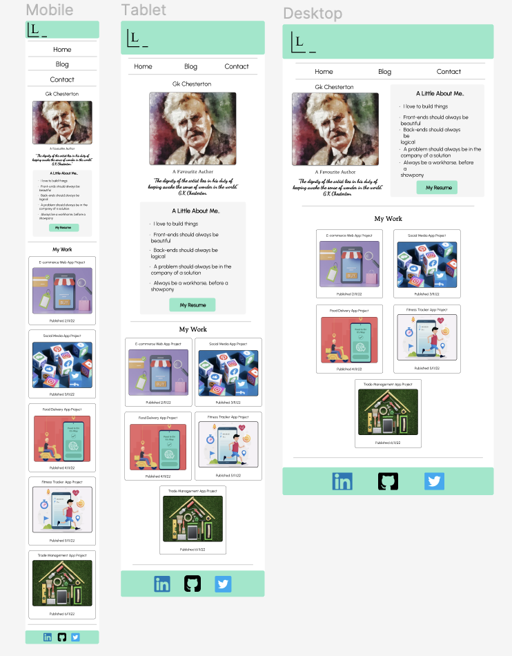
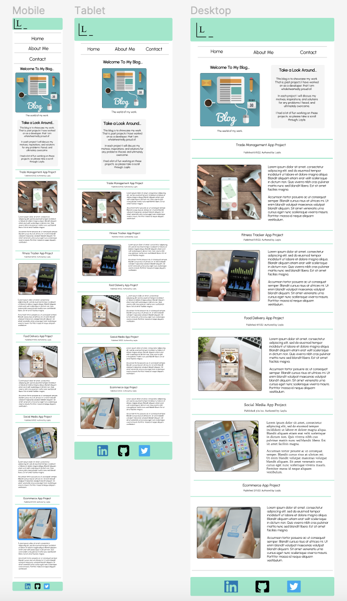
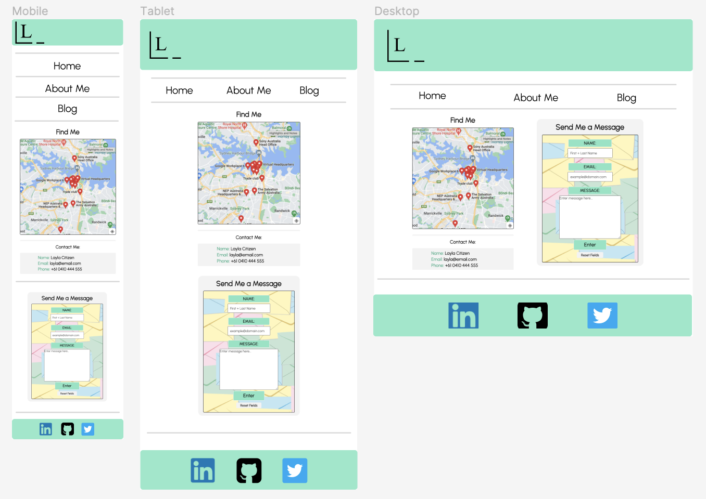
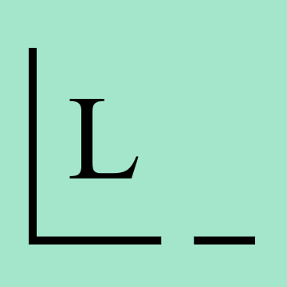

-  ## Link to Portfolio website:

    [My Portfolio Website] (https://layla-portfolio.netlify.app)

- ## Link to Github Repository:

    [LaylahDePaull_T1A2] (https://github.com/LaylaD4/LaylahDePaull_T1A2)

- ## Portfolio Website Desciption:
    
    **1. Purpose:** The purpose of my website is to showcase my skills, work projects, and give the reader some basic insight into my personality. The reader being a prospective employer.
    

    In the "Home" page I give a brief outline of my skills in programming, my love of travel, interests in the medical field, and my flexibility in a workplace. My purpose being; any prospective employer will not only be advised of my expertise in programming, but also see my willingness to travel around the world for work.
    
    In the "About Me" page I exhibit the projects I have worked on, and give the reader some specific insight into my personality and work ethic. My purpose being; to showcase my web development capabilities, make the reader aware that I work hard, am a problem solver, have a keen eye for design, a sharp logical mind, and am 'well read'. 

    The "Blog" page goes into further detail about the projects I have worked on, further demonstrating my aptitude in programming.

    **2. Functionality/Features:** 

    - **Navigation**: I made it very clear and easy for the user to navigate throughout my webpages. I used a fixed 'header at the top of all my pages with menu list items (Home, About Me, Blog, and Contact) all having large black fonts between 1.8-2.2rems (Mobile-Tablet-Desktop) that sat on a white background. Menu items at the mobile view are each clearly demarcated, and for larger desktop views, the hover pseudo class was used for menu items, so that they are highlighted when hovered over. Also the website Logo that sits in the top left corner of the header on all pages, also allows the user another way to navigate back to the home page.

        I used a fixed footer at the bottom of all pages with the requisite social media icons/images acting as links for the user to easily navigate to my social media pages of: Linkedin, Github, and Twitter.

        I also used many other images as links too. That is, 'My Work' projects (About Me Page) were all directly linked to the specific part of the (Blog) page where I had that particular blog post. I also used some automation for the 'My Work' image ‘cards’, that is on a Desktop, when hovered over, the images grew in size.
        
        I used a 'pointer' cursor to further help the user when navigating on my webpages on a Desktop view. So that the user could more easily identify a link.

        I built a form on the 'Contact' page that has the functionality of sending me an email. Text, Email, Textarea, Submit, and Reset inputs were all used for the form.

    - **Responsive Layout**: I used two Media breakpoints for the responsive design of my four webpages, that is; @834px min-width for a tablet viewport, and @1224px min-width for a desktop viewport. 
    
        For the mobile view: I used the 'mobile first' approach to web design. That is; the bulk of my code was written for the mobile view, and at the media breakpoint of 834px, specific code was written to overwrite the mobile view code to accomodate the change in screen size for a tablet viewport. Similarily, at 1224px further code was written again, to overwrite existing code to accommodate for the larger desktop viewport.

        To also aid in the responsiveness of my website for all the different viewports of: mobile, tablet, and desktop. I used the CSS Flexbox layout tool, to position the bulk of my components in my webpages.

    - **Design**: For the design of my webpages, I wanted to keep a consistent colour scheme and layout for the viewer. I decided on a clear, concise, and uncluttered design for the best possible viewer experience.
    
        I wanted to make sure all webpages looked liked they were related. I achieved this by mainly using only three colours that is; White, Black, Teal (#85E9C9), and a Light Grey (#F5F5F5). I also used a uniform font throughout, that is Google Fonts: 'Urbanist’; to keep all pages consistent with each other.

        The layout of my four webpages were also purposely kept as consistent as possible. With the design of fixed headers and footers all uniformly placed on each page.

    **3. Sitemap:** 

    
    
    
    **4. Screenshots:** Wireframes (Mobile **[@414px]**, Tablet **[@834px]**, Desktop **[@1224px]**):
        
        
    #### Home Page *(index.html)*
    
    
    

    #### About Me Page *(aboutme.html)*

    

    #### Blog Page *(blog.html)* 

    

    #### Contact Page *(contact.html)*

    

    **5. Target Audience:**

    My Portfolio website is targeted specifically to a prospective employer, with knowledge in information technology and software development.

    An employer who is looking for an IT professional with a great eye for front-end design of websites, web-apps, and applications. They are searching for a Web Developer who knows how to design a front-end with beauty, simplicity, and a great sense/instinct of what engages a user.

    An employer who is also looking for a Web developer with great back-end skills, that is; a large skill base in all the programmable and non-programmable coding languages that exist today. Someone who has a logical mind, excellent problem solving capabilities, an exemplary work ethic, and a well-rounded individual who is flexible about where they work.

    **5. Tech Stack:**

    - For my portfolio; I used the text editor **VS Code** to build my **HTML** and **CSS** documents.

    - I used **Figma** to design my 'wireframes', that is; the mock-ups of the four webpages of my website, what they should look like. 
    
    - I also used **Figma** to design my logo: (), and to generate my Favicon, I used: [Favicon] (https://favicon.io/)

    - I used the **Flaticon** website: [Flaticon] (https://www.flaticon.com/) to obtain my Linkedin icon: (), Github icon: (), and Twitter icon: ()
 
    - To track all the changes to my code, I used the version control system: **Git**.

    - **Github** is where my code was 'pushed'. Therefore, it is now being hosted publicly in the Github repository: [LaylahDePaull_T1A2] (https://github.com/LaylaD4/LaylahDePaull_T1A2).

    - Finally, I used **Netlify** to deploy my website: [My Portfolio Website] (https://layla-portfolio.netlify.app

 

